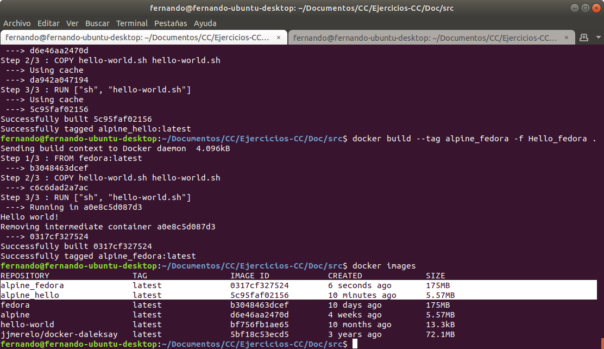

Para la realización de los siguientes ejercicios se ha realizado una instalación de Docker siguiendo los pasos descritos en la [página](https://docs.docker.com/engine/install/ubuntu/) de Docker. Posteriormente, se ha configurado el sistema para poder utilizar docker con un usuario sin privilegios, siguiendo esta [guia](https://docs.docker.com/engine/install/linux-postinstall/#manage-docker-as-a-non-root-user)

Una vez hecho esto se puede comprobar la instalación con el comando `docker run hello-world`

### Ejercicio 1: Buscar alguna demo interesante de Docker y ejecutarla localmente, o en su defecto, ejecutar la imagen anterior y ver cómo funciona y los procesos que se llevan a cabo la primera vez que se ejecuta y las siguientes ocasiones.

Tras ejecutar el comando `docker run --rm jjmerelo/docker-daleksay -f smiling-octopus <argumento>` por primera vez, docker busca la imagen jjmerelo/docker-daleksay de forma local. Al no encontrarla se la descarga de los [repositorios de Docker](https://hub.docker.com/r/jjmerelo/docker-daleksay/) y construye un contenedor con dicha imagen, imprimiendo un pulpo con el argumento que se le haya pasado.

En posteriores ejecuciones del comando no será necesario descargar la imagen nuevamente ya que se encuentra en el equipo. Esto será así a no ser que la imagen se borre del equipo.
A continuación se puede ver el resultado de ejecutar dicho comando, dado que no es la primera vez que se ejecuta en el equipo no es necesario descargar la imagen.

### Ejercicio 2: Tomar algún programa simple, “Hola mundo” impreso desde el intérprete de línea de órdenes, y comparar el tamaño de las imágenes de diferentes sistemas operativos base, Fedora, CentOS y Alpine, por ejemplo.

Para comparar el tamaño de los contenedores en función a sus imágenes base, he creado un [script shell](./src/hello-world.sh) en el cual se imprime en la consola "hello world". Para ello se han creado 2 dockerfiles diferentes: [Hello_alpine](./src/Hello_alpine) y [Hello_fedora](./src/Hello_fedora) siendo el contenido de todos ellos igual.

Tras la creación de ambos contenedores a partir de los dockerfiles podemos ver su tamaño usando el comando `docker images`. El resultado se muestra a continuación.

