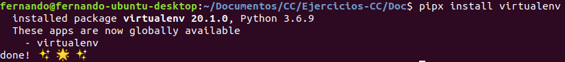
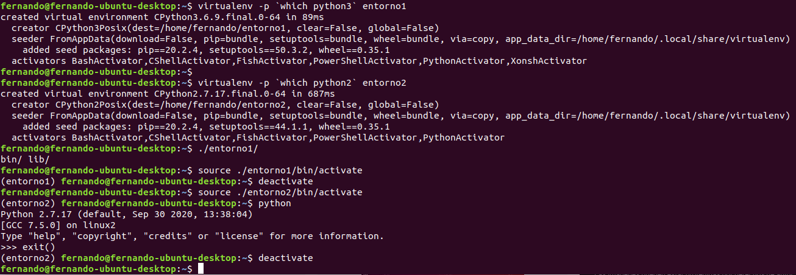

## Instalar alguno de los entornos virtuales de node.js (o de cualquier otro lenguaje con el que se esté familiarizado) y, con ellos, instalar la última versión existente, la versión minor más actual de la 4.x y lo mismo para la 0.11 o alguna impar (de desarrollo).

Para realizar este ejercicio y dado que estoy familiarizado con python, utilizaré dicho lenguaje para el desarrollo de estos ejercicios. Para comenzar y siguiendo lo comentado en la teoría del tema, utilizaremos la biblioteca de Python virtualenv. Como se puede ver en su [documentación](https://virtualenv.pypa.io/en/latest/installation.html#) se recomienda instalar esta herramienta usando [pipx](https://pipxproject.github.io/pipx/) ya que los paquetes que instalemos con este gestor de paquetes se instalaran en un ambiente aislado.
Dado que en mi equipo no tengo instalado pipx, habra que instalarlo como se comenta en su documentación. A la vez instalaremos tambien virtualenv una vez se haya instalado pipx, el proceso se detalla a continuación.

```
python3 -m pip install --user pipx
python3 -m pipx ensurepath
pipx install virtualenv
```
Cabe destacar, que de forma adicional, en sistemas Debian/Ubuntu es necesario instalar el paquete `python3-venv` antes de instalar virtualenv.



Una vez instalado, para crear un entorno virtual de python solo tendremos que utilizar el argumento `-Python=Python_EXE` especificando la ruta al ejecutable de la versión de python que queramos usar para crear el entorno virtual.

El resultado de la creación de un entorno virtual de Python en la versión más reciente y de un entorno con una versión más antigua e impar se puede ver en la siguiente imagen.



Ademas de crear los entornos, como se puede ver en la imagen anterior, también se muestra como activar y desactivar dichos entornos.

Otra cosa a tener en cuenta es la versión de Python que tenemos en nuestro sistema ya que no podremos crear un entorno con una versión que no este en nuestro sistema. Para ello podemos usar la herramienta [pyenv](https://github.com/pyenv/pyenv) con la que podremos gestionar muy fácilmente todas las versiones de python. Con esta herramienta tambien podremos crear entornos virtuales de python con el comando `pyenv virtualenv <version_python> <nombre_entorno>`.

## Crear una descripción del módulo usando package.json. En caso de que se trate de otro lenguaje, usar el método correspondiente.

Para realizar este ejercicio utilizaremos Python. En este lenguaje y más concretamente en pip existe de forma análoga a package.json los ficheros de requerimientos, en estos ficheros podremos especificar las dependencias entre módulos para ello basta con incluir en el fichero la línea `sqlite3>=3.0` y más tarde bastaría con realizar `pip install -r requerimientos.txt`. Sin embargo, sqlite3 ya está instalado por defecto en python3 por lo que no será necesario instalarlo.
